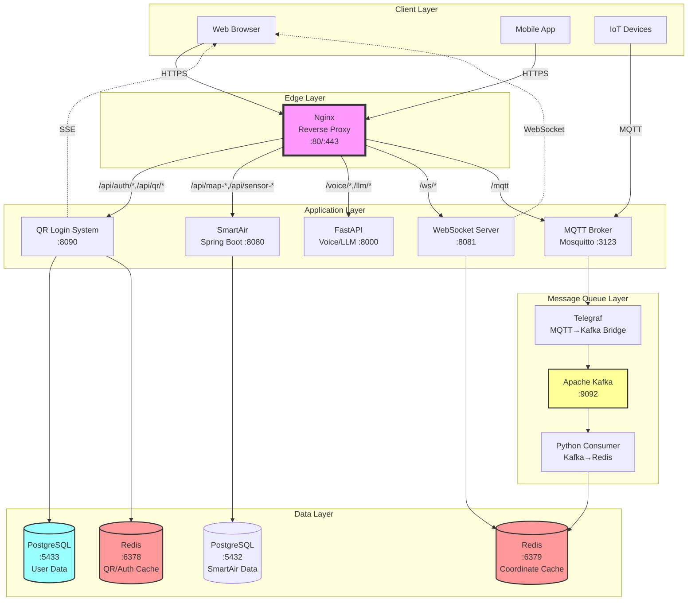
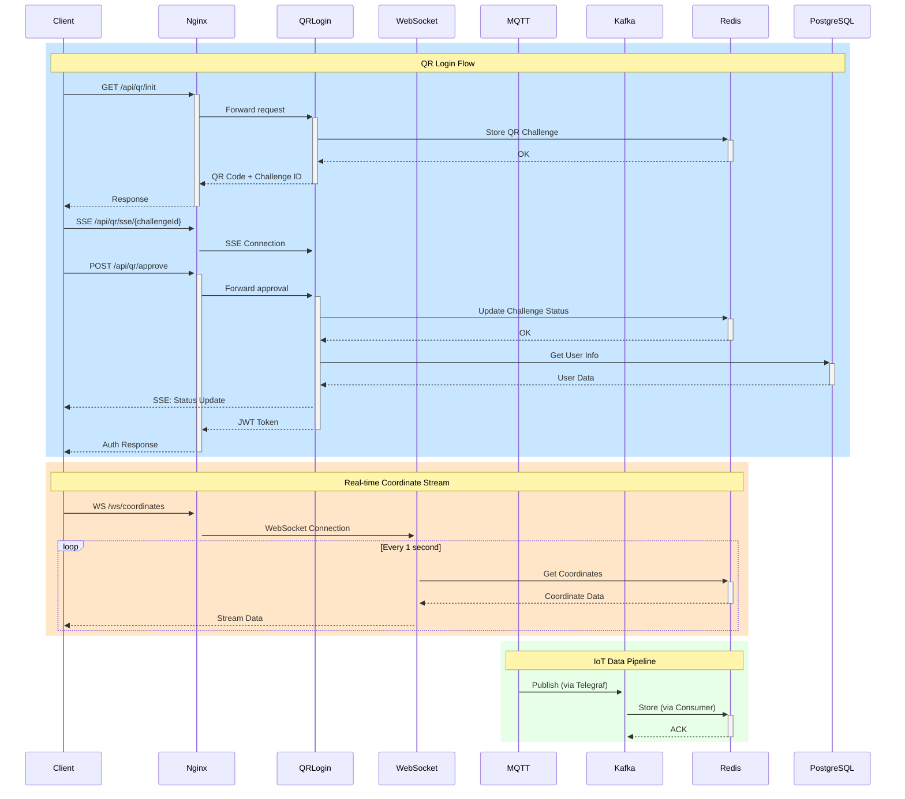
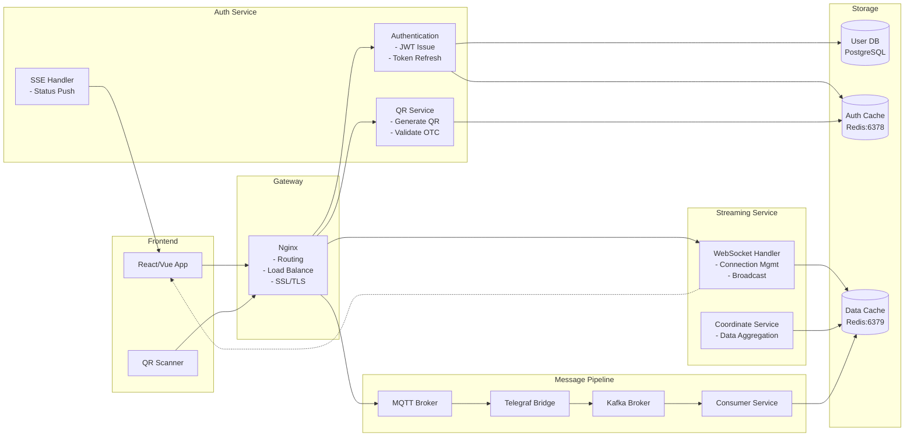
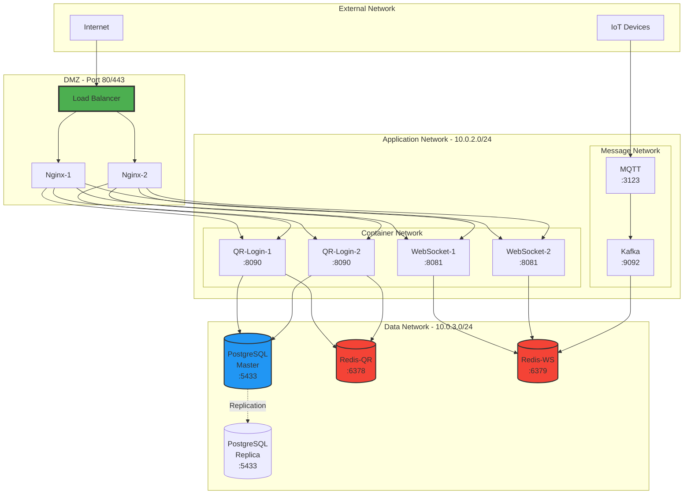
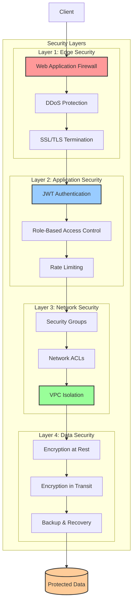

# AWS 아키텍처 다이어그램 구조

## 시스템 구성 요소 및 AWS 서비스 매핑

### 1. 네트워크 계층 (Edge Layer)
```
인터넷 → Route 53 (DNS) → CloudFront (CDN) → ALB (Application Load Balancer) → Nginx (Reverse Proxy)
```

### 2. Nginx 리버스 프록시 구성
```yaml
Nginx (Port 80/443)
├── /api/auth/* → QR Login System (8090)
├── /api/qr/* → QR Login System (8090)
├── /api/user/* → QR Login System (8090)
├── /api/map-upload/* → SmartAir Spring Boot (8080)
├── /api/map-data/* → SmartAir Spring Boot (8080)
├── /api/sensor-data/* → SmartAir Spring Boot (8080)
├── /api/schedule/* → SmartAir Spring Boot (8080)
├── /voice/* → FastAPI Voice Service (8000)
├── /llm/* → FastAPI LLM Service (8000)
├── /ws/* → WebSocket Server (8081)
├── /mqtt/* → MQTT Broker (3123)
└── / → Frontend (React/Vue)
```

### 3. 전체 시스템 아키텍처

```
┌─────────────────────────────────────────────────────────────────────┐
│                            Internet                                  │
└────────────────────────────┬────────────────────────────────────────┘
                             │
                    ┌────────▼────────┐
                    │   Route 53      │
                    │   (DNS)         │
                    └────────┬────────┘
                             │
                    ┌────────▼────────┐
                    │  CloudFront     │
                    │   (CDN)         │
                    └────────┬────────┘
                             │
                    ┌────────▼────────┐
                    │   AWS WAF       │
                    │  (Web Firewall) │
                    └────────┬────────┘
                             │
┌────────────────────────────▼────────────────────────────────────────┐
│                    VPC (10.0.0.0/16)                                │
│                                                                      │
│  ┌─────────────────────────────────────────────────────────────┐   │
│  │                Public Subnet (10.0.1.0/24)                  │   │
│  │                                                              │   │
│  │  ┌──────────────────────────────────────────────────────┐   │   │
│  │  │         Application Load Balancer (ALB)              │   │   │
│  │  │         - SSL/TLS Termination                        │   │   │
│  │  │         - Health Checks                              │   │   │
│  │  └────────────────────┬─────────────────────────────────┘   │   │
│  │                       │                                      │   │
│  │  ┌────────────────────▼─────────────────────────────────┐   │   │
│  │  │              Nginx (Reverse Proxy)                   │   │   │
│  │  │         ECS Service / EC2 Instance                   │   │   │
│  │  │         - Path-based routing                         │   │   │
│  │  │         - Load balancing                             │   │   │
│  │  │         - Rate limiting                              │   │   │
│  │  └───┬──────────┬──────────┬──────────┬────────────────┘   │   │
│  │      │          │          │          │                     │   │
│  └──────┼──────────┼──────────┼──────────┼─────────────────────┘   │
│         │          │          │          │                          │
│  ┌──────▼──────────▼──────────▼──────────▼─────────────────────┐   │
│  │              Private Subnet (10.0.2.0/24)                   │   │
│  │                                                              │   │
│  │  ┌─────────────┐  ┌─────────────┐  ┌──────────────┐       │   │
│  │  │ QR Login    │  │ WebSocket   │  │ MQTT Broker  │       │   │
│  │  │ System      │  │ Server      │  │ (Mosquitto)  │       │   │
│  │  │ Port: 8090  │  │ Port: 8081  │  │ Port: 3123   │       │   │
│  │  │ (ECS/Fargate)  │ (ECS/Fargate)  │ (EC2/ECS)    │       │   │
│  │  └──────┬──────┘  └──────┬──────┘  └──────┬───────┘       │   │
│  │         │                │                 │                │   │
│  │  ┌─────────────┐  ┌──────────────┐                        │   │
│  │  │ SmartAir    │  │ FastAPI      │                        │   │
│  │  │ Spring Boot │  │ Voice/LLM    │                        │   │
│  │  │ Port: 8080  │  │ Port: 8000   │                        │   │
│  │  │ (ECS/Fargate)  │ (ECS/Fargate) │                        │   │
│  │  └──────┬──────┘  └──────┬───────┘                        │   │
│  │         │                │                 │                │   │
│  │  ┌──────▼────────────────▼─────────────────▼───────────┐   │   │
│  │  │              Message Queue Layer                     │   │   │
│  │  │  ┌────────────┐  ┌─────────────┐  ┌────────────┐   │   │
│  │  │  │   Kafka    │  │  Telegraf   │  │  Python    │   │   │
│  │  │  │   (MSK)    │  │  (Bridge)   │  │  Consumer  │   │   │
│  │  │  └────────────┘  └─────────────┘  └────────────┘   │   │
│  │  └───────────────────────────────────────────────────────┘  │   │
│  │                                                              │   │
│  └───────────────────────────────────────────────────────────────┘  │
│                                                                      │
│  ┌─────────────────────────────────────────────────────────────┐   │
│  │            Data Subnet (10.0.3.0/24)                        │   │
│  │                                                              │   │
│  │  ┌──────────────┐  ┌──────────────┐  ┌──────────────┐     │   │
│  │  │ PostgreSQL   │  │ Redis (QR)   │  │ Redis (WS)   │     │   │
│  │  │ (RDS)        │  │ Port: 6378   │  │ Port: 6379   │     │   │
│  │  │ Port: 5433   │  │ (ElastiCache)│  │ (ElastiCache)│     │   │
│  │  └──────────────┘  └──────────────┘  └──────────────┘     │   │
│  │                                                              │   │
│  │  ┌──────────────┐                                          │   │
│  │  │ PostgreSQL   │                                          │   │
│  │  │ SmartAir DB  │                                          │   │
│  │  │ Port: 5432   │                                          │   │
│  │  │ (RDS)        │                                          │   │
│  │  └──────────────┘                                          │   │
│  │                                                              │   │
│  └───────────────────────────────────────────────────────────────┘  │
│                                                                      │
└──────────────────────────────────────────────────────────────────────┘
```

## AWS 서비스 매핑

### 네트워크 및 보안
- **Route 53**: DNS 관리
- **CloudFront**: CDN, 정적 컨텐츠 캐싱
- **AWS WAF**: 웹 애플리케이션 방화벽
- **VPC**: 가상 네트워크 (10.0.0.0/16)
- **Security Groups**: 포트별 접근 제어
- **NACLs**: 서브넷 레벨 보안

### 컴퓨팅
- **ALB**: 애플리케이션 로드 밸런서
- **ECS/Fargate**: 컨테이너 오케스트레이션
  - Nginx Container
  - QR Login System
  - WebSocket Server
  - SmartAir Spring Boot Service
  - FastAPI Voice/LLM Service
  - Kafka Consumer
- **EC2**: MQTT Broker (필요시)

### 데이터 스토리지
- **RDS PostgreSQL**: 
  - QR Login 사용자 데이터 (5433)
  - SmartAir 센서/지도 데이터 (5432)
- **ElastiCache Redis**: 
  - QR Login 캐시 (6378)
  - WebSocket 데이터 (6379)

### 메시징
- **Amazon MSK**: Kafka 클러스터
- **Amazon MQ**: MQTT Broker (대안)

### 모니터링 및 로깅
- **CloudWatch**: 로그 및 메트릭
- **X-Ray**: 분산 추적
- **CloudTrail**: API 감사

## Nginx 설정 예시

```nginx
# Nginx 리버스 프록시 설정
upstream qr_login {
    server qr-login-app:8090;
}

upstream websocket_server {
    server websocket-server:8081;
}

upstream mqtt_broker {
    server mosquitto:3123;
}

upstream smartair_app {
    server smartair-app:8080;
}

upstream fastapi_service {
    server my-fastapi-app:8000;
}

server {
    listen 80;
    listen 443 ssl http2;
    
    # SSL 설정
    ssl_certificate /etc/nginx/certs/cert.pem;
    ssl_certificate_key /etc/nginx/certs/key.pem;
    
    # QR Login API
    location /api/ {
        proxy_pass http://qr_login;
        proxy_set_header Host $host;
        proxy_set_header X-Real-IP $remote_addr;
        proxy_set_header X-Forwarded-For $proxy_add_x_forwarded_for;
        proxy_set_header X-Forwarded-Proto $scheme;
    }
    
    # SSE endpoint for QR status
    location /api/qr/sse/ {
        proxy_pass http://qr_login;
        proxy_set_header Connection '';
        proxy_http_version 1.1;
        chunked_transfer_encoding off;
        proxy_buffering off;
        proxy_cache off;
    }
    
    # WebSocket
    location /ws/ {
        proxy_pass http://websocket_server;
        proxy_http_version 1.1;
        proxy_set_header Upgrade $http_upgrade;
        proxy_set_header Connection "upgrade";
        proxy_set_header Host $host;
        proxy_set_header X-Real-IP $remote_addr;
    }
    
    # MQTT over WebSocket
    location /mqtt {
        proxy_pass http://mqtt_broker;
        proxy_http_version 1.1;
        proxy_set_header Upgrade $http_upgrade;
        proxy_set_header Connection "upgrade";
    }
    
    # SmartAir Spring Boot API
    location ~ ^/api/(map-upload|map-data|sensor-data|schedule)/ {
        proxy_pass http://smartair_app;
        proxy_set_header Host $host;
        proxy_set_header X-Real-IP $remote_addr;
        proxy_set_header X-Forwarded-For $proxy_add_x_forwarded_for;
        proxy_set_header X-Forwarded-Proto $scheme;
    }
    
    # FastAPI Voice/LLM Service
    location ~ ^/(voice|llm)/ {
        proxy_pass http://fastapi_service;
        proxy_set_header Host $host;
        proxy_set_header X-Real-IP $remote_addr;
        proxy_set_header X-Forwarded-For $proxy_add_x_forwarded_for;
        proxy_set_header X-Forwarded-Proto $scheme;
    }
    
    # Frontend
    location / {
        root /usr/share/nginx/html;
        try_files $uri $uri/ /index.html;
    }
}
```

## 트래픽 흐름

### 1. 일반 API 요청
```
Client → CloudFront → ALB → Nginx → QR Login System → RDS/Redis
```

### 2. WebSocket 연결
```
Client → CloudFront → ALB → Nginx → WebSocket Server → Redis → Client
```

### 3. MQTT 데이터 흐름
```
IoT Device → MQTT Broker → Telegraf → Kafka (MSK) → Consumer → Redis
```

### 4. SSE (Server-Sent Events)
```
Client → CloudFront → ALB → Nginx → QR Login System (SSE) → Client
```

### 5. SmartAir 센서 데이터 흐름
```
IoT Device → API → SmartAir Spring Boot → PostgreSQL (5432)
```

### 6. Voice/LLM 처리 흐름
```
Client → CloudFront → ALB → Nginx → FastAPI → LLM Processing → Client
```

## 포트 매핑

| 서비스 | 내부 포트 | Nginx 경로 | 설명 |
|--------|-----------|------------|------|
| Nginx | 80/443 | / | 리버스 프록시 |
| QR Login | 8090 | /api/auth/*, /api/qr/*, /api/user/* | 인증 REST API |
| SmartAir Spring Boot | 8080 | /api/map-*, /api/sensor-*, /api/schedule/* | IoT 관리 API |
| FastAPI | 8000 | /voice/*, /llm/* | 음성/AI 처리 |
| WebSocket | 8081 | /ws/* | 실시간 좌표 |
| MQTT | 3123 | /mqtt | IoT 통신 |
| PostgreSQL (QR) | 5433 | - | QR 인증 DB |
| PostgreSQL (SmartAir) | 5432 | - | 센서/지도 DB |
| Redis (QR) | 6378 | - | 인증 캐시 |
| Redis (WS) | 6379 | - | 좌표 캐시 |
| Kafka | 9092 | - | 메시지 브로커 |

## AWS 배포 고려사항

### 1. 고가용성
- Multi-AZ RDS 배포
- ElastiCache 클러스터 모드
- ECS 서비스 Auto Scaling
- ALB 크로스존 로드 밸런싱

### 2. 보안
- VPC 엔드포인트 사용
- Secrets Manager로 인증 정보 관리
- IAM 역할 기반 접근 제어
- VPN 또는 Direct Connect (온프레미스 연동시)

### 3. 비용 최적화
- Spot 인스턴스 활용 (상태 비저장 워크로드)
- Reserved Instances (RDS, ElastiCache)
- S3 Intelligent-Tiering (로그 저장)
- Lambda (경량 처리 작업)

### 4. 모니터링
- CloudWatch 대시보드
- 커스텀 메트릭 설정
- 알람 및 자동 복구
- Application Insights

## 시스템 아키텍처 다이어그램

### 전체 시스템 플로우 다이어그램



### 데이터 플로우 시퀀스 다이어그램



### 컴포넌트 상호작용 다이어그램



### 네트워크 토폴로지 다이어그램



### 보안 아키텍처 다이어그램



### 배포 파이프라인 다이어그램

```mermaid
graph LR
    subgraph "Development"
        DEV[Developer] --> GIT[Git Repository]
    end
    
    subgraph "CI/CD Pipeline"
        GIT --> CI[GitHub Actions]
        CI --> BUILD[Build<br/>- Compile<br/>- Test<br/>- Package]
        BUILD --> SCAN[Security Scan<br/>- SAST<br/>- Dependency Check]
        SCAN --> IMAGE[Container Image<br/>- Docker Build<br/>- Push to ECR]
    end
    
    subgraph "Deployment Stages"
        IMAGE --> DEV_ENV[Development<br/>Environment]
        DEV_ENV --> TEST_ENV[Testing<br/>Environment]
        TEST_ENV --> STAGE_ENV[Staging<br/>Environment]
        STAGE_ENV --> PROD_ENV[Production<br/>Environment]
    end
    
    subgraph "Monitoring"
        PROD_ENV --> MONITOR[CloudWatch<br/>Prometheus<br/>Grafana]
        MONITOR --> ALERT[Alert Manager]
        ALERT --> DEV
    end
    
    style GIT fill:#f9f,stroke:#333,stroke-width:2px
    style CI fill:#9f9,stroke:#333,stroke-width:2px
    style PROD_ENV fill:#99f,stroke:#333,stroke-width:2px
    style ALERT fill:#f99,stroke:#333,stroke-width:2px
```

