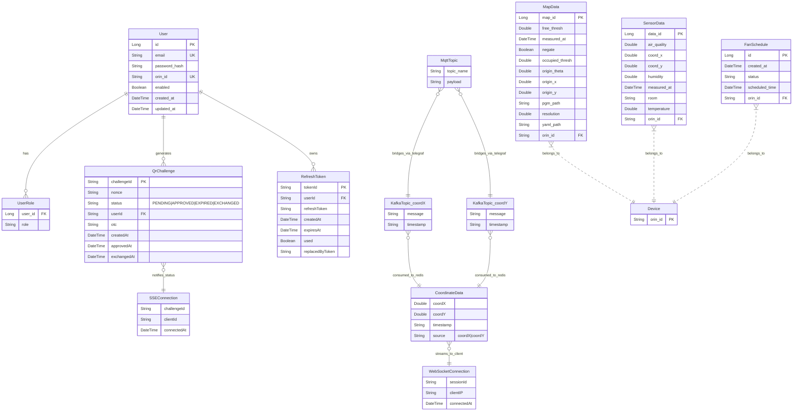

# Entity Relationship Diagram (ERD)

## 시스템 아키텍처 개요

이 시스템은 MQTT, Kafka, Redis, WebSocket을 활용한 실시간 데이터 처리 및 QR 로그인 시스템으로 구성되어 있습니다.

## 주요 구성 요소

### 1. QR Login System (PostgreSQL + Redis)
- **PostgreSQL**: User 데이터 영구 저장
- **Redis**: QR Challenge, Refresh Token 임시 저장 및 캐싱

### 2. MQTT-Kafka Bridge
- **Mosquitto (MQTT Broker)**: IoT 디바이스로부터 메시지 수신
- **Kafka**: MQTT 메시지를 Kafka 토픽으로 브릿지 (Telegraf 사용)

### 3. Kafka-Redis-WebSocket Pipeline  
- **Kafka**: 좌표 데이터 스트리밍 (coordX, coordY 토픽)
- **Redis**: Kafka에서 소비한 좌표 데이터 임시 저장
- **WebSocket Server**: Redis에서 데이터 읽어 클라이언트로 실시간 전송

### 4. IoT Device & Sensor Suite (PostgreSQL + MQTT/Kafka)
- **Device (PostgreSQL)**: ORIN 디바이스 레지스트리(`orin_id`)
- **MapData (PostgreSQL)**: 맵 메타데이터(해상도, 원점, 임계치, PGM/YAML 경로)
- **SensorData (PostgreSQL)**: 센서 원시/전처리 데이터(공기질·온습도·좌표·측정시각·룸)
- **FanSchedule (PostgreSQL)**: 팬 동작 스케줄(생성시각, 예약시각, 상태, 대상 `orin_id`)
- **브릿지/처리**: Mosquitto → Telegraf → Kafka → Consumer(실시간은 Redis, 이력은 PostgreSQL 저장)

## Entity Relationship Diagram



## 데이터 저장소별 엔티티 분류

### PostgreSQL (영구 저장소)
- **User**: 사용자 계정 정보
- **UserRole**: 사용자 권한 (USER, ADMIN)
- **Device**: ORIN 디바이스 레지스트리 (키: orin_id)
- **MapData**: ORIN 맵 메타데이터 및 변환 정보
- **SensorData**: 환경 센서 데이터(공기질, 온습도, 좌표 등)
- **FanSchedule**: 디바이스 팬 동작 스케줄

### Redis - QR Login (Port: 6378)
- **QrChallenge**: QR 코드 챌린지 (TTL: 120초)
- **RefreshToken**: JWT 리프레시 토큰 (TTL: 7일)

### Redis - WebSocket (Port: 6379)  
- **CoordinateData**: MQTT에서 수신한 좌표 데이터 (실시간 스트리밍)

### Kafka Topics
- **coordX**: X 좌표 데이터 토픽
- **coordY**: Y 좌표 데이터 토픽

## 데이터 흐름

### 1. MQTT → Kafka → Redis → WebSocket
```
IoT Device → MQTT Broker → Telegraf → Kafka → Python Consumer → Redis → Spring WebSocket → Client
```

### 2. QR Login Flow
```
Client → Generate QR → Redis (QrChallenge) → Mobile Scan → Approve → Redis Update → SSE Notify → JWT Token
```

### 3. Authentication Flow
```
Login → PostgreSQL (User) → JWT Access Token + Refresh Token → Redis (RefreshToken Cache)
```

### 4. IoT 디바이스/센서 + 팬 스케줄 Flow
```
1) 디바이스 등록
Admin/API → PostgreSQL (Device)

2) 맵 데이터 반영
ORIN/백엔드 → PostgreSQL (MapData)  [PGM/YAML 경로, origin/resolution/thresholds]

3) 센서 텔레메트리 수집 및 저장
Device → MQTT (Mosquitto) → Telegraf → Kafka → Consumer →
    ├─ Redis (실시간 스트리밍)
    └─ PostgreSQL (SensorData, 영구 저장)

4) 팬 제어 스케줄링
API → PostgreSQL (FanSchedule) → Scheduler/Worker → MQTT Command → Device
```

## 주요 특징

1. **이중 Redis 구성**
- QR Login용 Redis (6378): 인증 관련 임시 데이터
- WebSocket용 Redis (6379): 실시간 스트리밍 데이터

2. **실시간 통신**
- SSE (Server-Sent Events): QR 로그인 상태 알림
- WebSocket: 좌표 데이터 실시간 스트리밍

3. **메시지 브릿지**
- Telegraf: MQTT → Kafka 브릿지
- Python Consumer: Kafka → Redis 브릿지

4. **보안**
- JWT 기반 인증
- QR Challenge + OTC (One-Time Code) 검증
- Refresh Token Rotation

5. **디바이스 중심 스키마**
    - `Device(orin_id)`를 기준으로 `MapData`, `SensorData`, `FanSchedule`가 참조(FK)

6. **이력 + 실시간 이중 경로**
    - 실시간: Redis/WebSocket, 이력: PostgreSQL(SensorData) 저장으로 분석/대시보드 대응

7. **맵 메타데이터 관리**
    - 해상도/원점/점유·자유 임계치와 PGM/YAML 경로를 구조화하여 버전 관리 용이

8. **스케줄 기반 제어**
    - FanSchedule로 예약 실행·상태 추적이 가능하며 실행 시 MQTT 명령으로 디바이스 제어

## 서비스 포트 정보

| 서비스 | 포트 | 설명 |
|--------|------|------|
| PostgreSQL | 5433 | QR Login 데이터베이스 |
| Redis (QR) | 6378 | QR Login 캐시 |
| Redis (WS) | 6379 | WebSocket 데이터 |
| Kafka | 9092 | 메시지 브로커 |
| MQTT | 3123 | MQTT 브로커 |
| QR Login API | 8090 | REST API |
| WebSocket Server | 8081 | 실시간 좌표 스트리밍 |