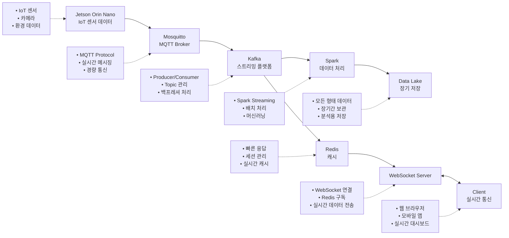
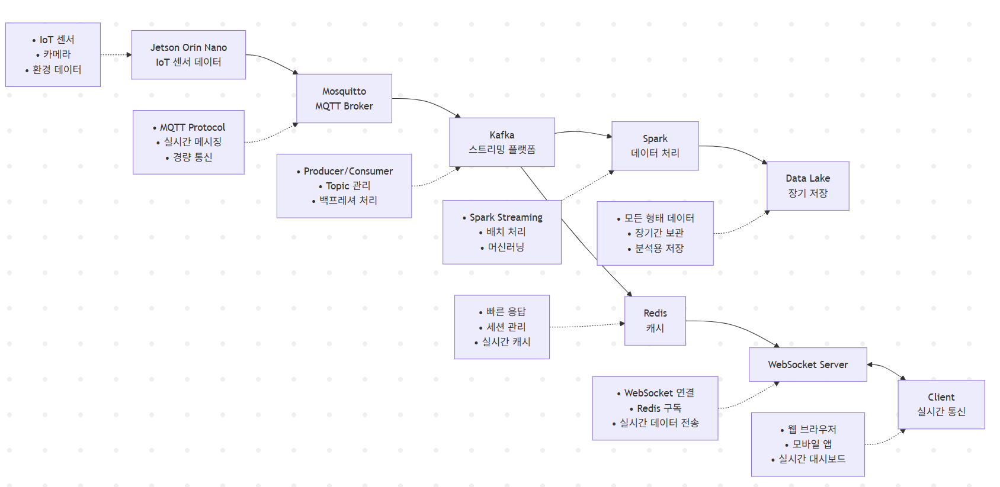

# IoT Server

```mermaid
graph LR
    A[Jetson Orin Nano<br/>IoT 센서 데이터] --> B[Mosquitto<br/>MQTT Broker]
    B --> C[Kafka<br/>스트리밍 플랫폼]
    C --> E[Redis<br/>캐시]
    C --> D[Spark<br/>데이터 처리]
    D --> F[Data Lake<br/>장기 저장]
    E --> G[WebSocket Server]
    G <--> H[Client<br/>실시간 통신]
    
    A1[• IoT 센서<br/>• 카메라<br/>• 환경 데이터] -.-> A
    B1[• MQTT Protocol<br/>• 실시간 메시징<br/>• 경량 통신] -.-> B
    C1[• Producer/Consumer<br/>• Topic 관리<br/>• 백프레셔 처리] -.-> C
    D1[• Spark Streaming<br/>• 배치 처리<br/>• 머신러닝] -.-> D
    E1[• 빠른 응답<br/>• 세션 관리<br/>• 실시간 캐시] -.-> E
    F1[• 모든 형태 데이터<br/>• 장기간 보관<br/>• 분석용 저장] -.-> F
    G1[• WebSocket 연결<br/>• Redis 구독<br/>• 실시간 데이터 전송] -.-> G
    H1[• 웹 브라우저<br/>• 모바일 앱<br/>• 실시간 대시보드] -.-> H
```

