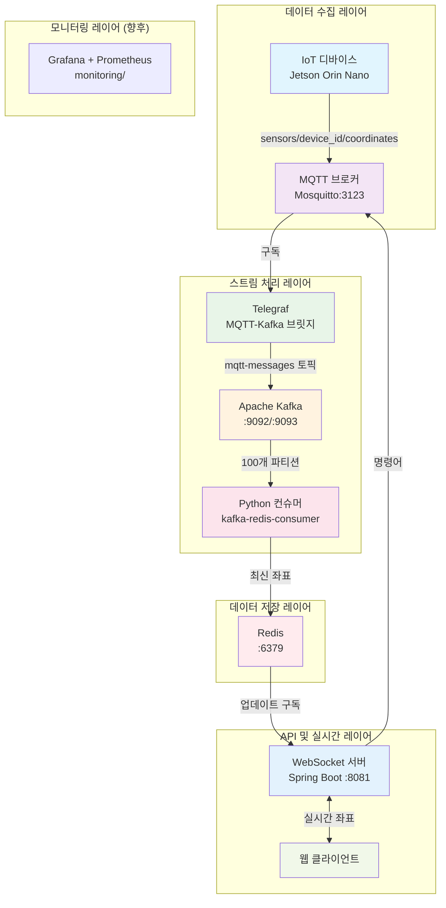

# IoT MQTT 서버 - 실시간 좌표 스트리밍 시스템

Spring Boot, MQTT, Kafka, Redis, WebSocket을 활용한 실시간 좌표 추적 및 디바이스 명령 관리를 위한 종합 IoT 데이터 파이프라인입니다.

## 🏗️ 시스템 아키텍처



## 🚀 주요 기능

### 실시간 데이터 파이프라인
- **서브초 지연시간**: 100ms 수집 간격으로 최대 200ms 플러시
- **고처리량**: 병렬 처리를 위한 100개 Kafka 파티션
- **자동 확장**: 최대 성능을 위한 직접 파티션 할당

### WebSocket 스트리밍
- **실시간 좌표 브로드캐스팅** 1초마다 실행
- **다중 클라이언트 지원** 동시 WebSocket 연결
- **CORS 활성화** 웹 애플리케이션 통합

### 디바이스 명령 인터페이스
- **MQTT 명령 발행**으로 IoT 디바이스 제어
- **사전 정의된 명령어**: `tracking`, `slam`, `none`
- **커스텀 명령어** 디바이스별 타겟팅
- **REST API 엔드포인트** 외부 통합

### 데이터 관리
- **Redis 캐싱** 빠른 데이터 검색
- **메시지 지속성** 자동 정리 기능
- **디바이스별 통계** 및 메시지 카운팅
- **상태 모니터링** 및 시스템 통계

## 📦 서비스 구성

| 서비스 | 포트 | 용도 | 기술 스택 |
|---------|------|---------|------------|
| **mosquitto** | 3123 | MQTT 메시지 브로커 | Eclipse Mosquitto |
| **kafka** | 9092, 9093 | 스트림 처리 플랫폼 | Apache Kafka (KRaft) |
| **telegraf** | - | MQTT-Kafka 브릿지 | InfluxData Telegraf |
| **redis** | 6379 | 데이터 캐싱 및 pub/sub | Redis 7.2 |
| **kafka-redis-consumer** | - | 데이터 처리 파이프라인 | Python |
| **websocket-server** | 8081 | WebSocket 및 REST API | Spring Boot |

## 🛠️ 빠른 시작

### 사전 요구사항
- Docker 및 Docker Compose
- Make 유틸리티

### 설정 및 실행

#### 1. 환경 변수 설정 (필수)
```bash
# .env 파일 생성
cp .env.example .env

# .env 파일을 열고 필수 값 변경:
# - DATABASE_PASSWORD: PostgreSQL 비밀번호
# - JWT_SECRET: JWT 토큰 시크릿 (openssl rand -base64 64로 생성)
# - MQTT_USERNAME, MQTT_PASSWORD: MQTT 인증 정보 (프로덕션 환경)
```

⚠️ **중요**: `.env` 파일은 절대 Git에 커밋하지 마세요! 이미 `.gitignore`에 포함되어 있습니다.

#### 2. 서비스 시작
```bash
# 모든 서비스 초기화 및 시작
make setup

# 또는 단계별로:
make build    # Docker 이미지 빌드
make up       # 서비스 시작
```

### 설치 확인
```bash
# 서비스 로그 확인
make logs

# MQTT 메시징 테스트
make test-mqtt

# 전체 파이프라인 테스트
make test-redis-pipeline

# WebSocket 서버 접근
curl http://localhost:8081/api/health
```

## 📡 API 엔드포인트

### WebSocket 연결
```javascript
const ws = new WebSocket('ws://localhost:8081/coordinates');
ws.onmessage = (event) => {
    const data = JSON.parse(event.data);
    console.log('좌표:', data);
};
```

### REST API
- **GET** `/api/health` - 서버 상태 확인
- **GET** `/api/stats` - Redis 통계 및 메시지 수
- **GET** `/api/coordinates` - 모든 디바이스의 현재 좌표 데이터
- **POST** `/api/commands/{orinId}` - 특정 디바이스에 명령 전송
  ```json
  {
    "command": "tracking|slam|none|사용자정의명령"
  }
  ```

### Swagger 문서
대화형 API 문서: `http://localhost:8081/swagger-ui.html`

## 📊 MQTT 토픽

### 데이터 수집 토픽
```bash
sensors/{device_id}/coordinates   # IoT 디바이스의 좌표 데이터
```

### 명령 토픽  
```bash
orin/{device_id}/command         # IoT 디바이스로 전송되는 명령
```

### 사용 예제
```bash
# 좌표 데이터 전송
mosquitto_pub -h localhost -p 3123 -t "sensors/robot1/coordinates" \
  -m '{"x": 123.45, "y": 67.89, "timestamp": 1691234567}'

# 디바이스 명령 전송
mosquitto_pub -h localhost -p 3123 -t "orin/robot1/command" -m "tracking"
```

## 🔧 개발 명령어

### 서비스 관리
```bash
make up          # 모든 서비스 시작
make down        # 모든 서비스 중지
make restart     # 모든 서비스 재시작
make clean       # 컨테이너 및 볼륨 제거
```

### 모니터링 및 디버깅
```bash
make logs                        # 모든 서비스 로그
make websocket-logs             # WebSocket 서버 로그
make kafka-logs                 # Kafka 브로커 로그
make redis-logs                 # Redis 서버 로그
make kafka-redis-consumer-logs  # 컨슈머 로그
```

### 테스트
```bash
make test-mqtt                  # MQTT 메시징 테스트
make test-redis-pipeline       # MQTT → Kafka → Redis 플로우 테스트
make test-websocket-pipeline   # 전체 파이프라인 테스트
make websocket-test            # WebSocket 엔드포인트 테스트
```

### 유틸리티 명령
```bash
make redis-cli        # Redis CLI 접근
make list-topics      # Kafka 토픽 보기
make consume-messages # Kafka 메시지 모니터링
```

## 📁 프로젝트 구조

```
mqttserver/
├── docker-compose.yml           # 서비스 오케스트레이션
├── Makefile                     # 개발 명령어
├── monitoring/                  # 향후: Grafana, Prometheus 설정
├── mosquitto/                   # MQTT 브로커 설정
│   ├── Dockerfile
│   ├── mosquitto.conf          # MQTT 브로커 설정
│   └── passwd                  # MQTT 인증
├── kafka/                       # Kafka 브로커 설정
│   ├── Dockerfile
│   ├── kafka-server.properties # Kafka 설정
│   └── scripts/init_topics.sh  # 토픽 초기화
├── telegraf/                    # MQTT-Kafka 브릿지
│   ├── Dockerfile  
│   └── telegraf.conf           # 브릿지 설정
├── kafka-redis-consumer/        # Python 데이터 처리기
│   ├── Dockerfile
│   ├── consumer.py             # Kafka → Redis 처리기
│   └── requirements.txt
└── websocket-server/           # Spring Boot 애플리케이션
    ├── Dockerfile
    ├── pom.xml                 # Maven 의존성
    └── src/main/
        ├── java/com/example/websocket/
        │   ├── WebSocketServerApplication.java  # 메인 애플리케이션
        │   ├── config/         # Spring 설정
        │   ├── controller/     # REST 엔드포인트
        │   ├── handler/        # WebSocket 핸들러
        │   ├── model/          # 데이터 모델
        │   ├── scheduler/      # 브로드캐스트 스케줄러
        │   └── service/        # 비즈니스 로직
        └── resources/
            ├── application.yml  # Spring Boot 설정
            └── static/index.html # 웹 클라이언트 예제
```

## ⚙️ 설정

### 주요 설정 파일

| 파일 | 용도 |
|------|---------|
| `websocket-server/src/main/resources/application.yml` | Spring Boot, Redis, MQTT 설정 |
| `telegraf/telegraf.conf` | MQTT 구독 및 Kafka 발행 설정 |
| `mosquitto/mosquitto.conf` | MQTT 브로커 설정 및 인증 |
| `kafka/kafka-server.properties` | Kafka 브로커 설정 |

### 환경 변수

```bash
# Redis 설정
SPRING_DATA_REDIS_HOST=redis
SPRING_DATA_REDIS_PORT=6379

# Kafka 설정
KAFKA_BOOTSTRAP_SERVERS=kafka:9092

# 애플리케이션 설정
SERVER_PORT=8081
```

## 🚦 시스템 요구사항

- **CPU**: 2코어 이상 권장
- **메모리**: 모든 서비스 실행을 위해 4GB+ RAM
- **저장공간**: Docker 이미지 및 데이터 볼륨을 위해 2GB+
- **네트워크**: 포트 3123, 6379, 8081, 9092, 9093 사용 가능

## 📈 성능 특성

- **데이터 수집**: 100ms 간격, 최대 200ms 미만 지연시간
- **메시지 처리량**: 파티션당 초당 1000+ 메시지
- **WebSocket 브로드캐스팅**: 배치 처리로 1초 간격
- **동시 연결**: 다중 WebSocket 클라이언트 지원
- **데이터 보관**: 설정 가능한 Redis TTL 및 Kafka 보관 정책

## 🔮 향후 개선사항

### 모니터링 및 관측성
- **Grafana 대시보드**: 실시간 메트릭 시각화
- **Prometheus 메트릭**: 시스템 및 애플리케이션 모니터링
- **로그 집계**: ELK 스택을 통한 중앙화된 로깅
- **경고 관리**: 임계값 기반 알림

### 확장성 기능
- **Kafka 클러스터**: 고가용성을 위한 다중 브로커 설정
- **Redis 클러스터**: 분산 캐싱 및 데이터 샤딩
- **로드 밸런싱**: 다중 WebSocket 서버 인스턴스

### 추가 기능
- **인증**: JWT 기반 API 보안
- **데이터 지속성**: 장기 저장소 통합
- **머신러닝**: 실시간 분석 및 예측
- **모바일 SDK**: 네이티브 모바일 클라이언트 라이브러리

