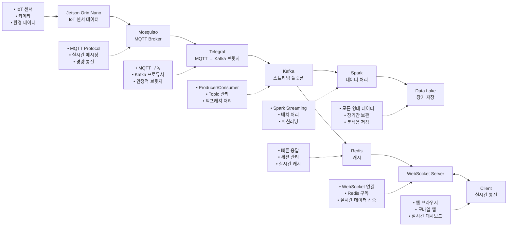

# IoT Server



## 아키텍처 구성 요소

### 1. **MQTT Broker (Mosquitto)**
- IoT 센서 데이터 수집
- 경량 실시간 메시징 프로토콜

### 2. **MQTT → Kafka 브릿지 (Telegraf)**
- MQTT 메시지를 Kafka로 안정적으로 전송
- 고성능, 경량화된 데이터 수집 에이전트
- Kafka Connect보다 설정이 간단하고 안정적

### 3. **Kafka (스트리밍 플랫폼)**
- 대용량 실시간 데이터 스트리밍
- 분산 처리 및 내결함성

### 4. **Redis (캐시)**
- 빠른 응답을 위한 메모리 캐시
- 세션 관리

### 5. **Spark (데이터 처리)**
- 스트리밍 및 배치 데이터 처리
- 머신러닝 분석

### 6. **WebSocket Server**
- 클라이언트와 실시간 양방향 통신

## 사용법

### 전체 시스템 시작
```bash
make setup
```

### 개별 서비스 관리
```bash
# 서비스 시작
make up

# 서비스 중지
make down

# 로그 확인
make logs
make telegraf-logs

# 토픽 목록 확인
make list-topics

# MQTT 테스트 메시지 발행
make test-mqtt

# Kafka 메시지 확인
make consume-messages
```

### MQTT 메시지 발행 (외부에서)
```bash
# 좌표 데이터
mosquitto_pub -h <서버IP> -t "sensors/robot1/coordX" -m "123.45"
mosquitto_pub -h <서버IP> -t "sensors/robot1/coordY" -m "67.89"
mosquitto_pub -h <서버IP> -t "sensors/robot1/motorRPM" -m "1500"

# 테스트 메시지
mosquitto_pub -h <서버IP> -t "test/hello" -m "Hello World!"
```

## 구성 파일

- `telegraf/telegraf.conf`: Telegraf 설정 (MQTT → Kafka 브릿지)
- `mosquitto/mosquitto.conf`: MQTT 브로커 설정
- `kafka/kafka-server.properties`: Kafka 브로커 설정
- `docker-compose.yml`: 전체 서비스 오케스트레이션

