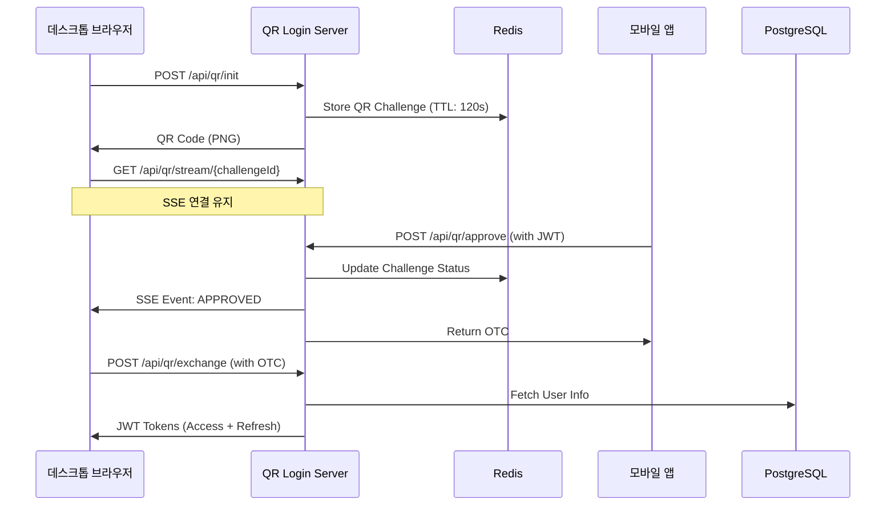

# QR Login System

> QR 코드 기반 인증 시스템 with Spring Boot + JWT + SSE

## 📖 개요

QR Login System은 모바일 앱에서 QR 코드를 스캔하여 데스크톱 브라우저에 자동으로 로그인할 수 있는 현대적인 인증 시스템입니다. 실시간 상태 업데이트와 보안성을 강화한 JWT 기반 토큰 시스템을 제공합니다.

## ✨ 주요 기능

- **🔐 QR 기반 로그인**: 모바일 앱으로 QR 코드 스캔하여 데스크톱 로그인
- **⚡ 실시간 상태 업데이트**: SSE(Server-Sent Events)를 통한 실시간 알림  
- **🛡️ JWT 인증 시스템**: Access/Refresh Token 패턴 + 토큰 회전
- **👤 사용자 관리**: 회원가입/로그인/역할 기반 인증
- **📱 RESTful API**: 완전한 REST API 지원
- **📚 API 문서화**: Swagger/OpenAPI 3.0 통합
- **🐳 Docker 지원**: 완전한 컨테이너화 환경

## 🏗️ 아키텍처



## 🚀 빠른 시작

### 전제 조건

- Docker & Docker Compose
- Java 17+ (로컬 개발 시)
- Git

### Docker로 실행

```bash
# 저장소 클론
git clone <repository-url>
cd qr-login-system

# Docker 컨테이너 실행
docker compose up -d

# 애플리케이션 상태 확인
curl http://localhost:8080/actuator/health
```

### 로컬 개발 환경

```bash
# Gradle 빌드
./gradlew build

# 로컬 프로필로 실행 (H2 데이터베이스 사용)
./gradlew bootRun --args='--spring.profiles.active=local'
```

## 📋 API 엔드포인트

### 🔐 인증 API

| Method | Endpoint | 설명 | 인증 필요 |
|--------|----------|------|-----------|
| POST | `/api/auth/signup` | 사용자 회원가입 | ❌ |
| POST | `/api/auth/login` | 이메일/패스워드 로그인 | ❌ |
| POST | `/api/auth/refresh` | 토큰 갱신 | ❌ |

### 📱 QR 로그인 API  

| Method | Endpoint | 설명 | 인증 필요 |
|--------|----------|------|-----------|
| POST | `/api/qr/init` | QR 코드 생성 | ❌ |
| POST | `/api/qr/approve` | QR 코드 승인 (모바일) | ✅ |
| GET | `/api/qr/status/{challengeId}` | QR 상태 확인 | ❌ |
| POST | `/api/qr/exchange` | OTC → JWT 토큰 교환 | ❌ |

### 🌊 실시간 SSE API

| Method | Endpoint | 설명 | 인증 필요 |
|--------|----------|------|-----------|
| GET | `/api/qr/stream/{challengeId}` | SSE 실시간 상태 스트림 | ❌ |
| GET | `/api/qr/stream/stats/{challengeId}` | SSE 연결 통계 | ❌ |

### 👤 사용자 API

| Method | Endpoint | 설명 | 인증 필요 |
|--------|----------|------|-----------|
| GET | `/api/users/me` | 현재 사용자 정보 조회 | ✅ |

## 🔄 QR 로그인 플로우

### 1. 데스크톱 브라우저 (클라이언트)

```javascript
// 1. QR 코드 초기화
const initResponse = await fetch('/api/qr/init', { method: 'POST' });
const challengeId = initResponse.headers.get('X-Challenge-Id');

// 2. SSE 연결로 실시간 상태 수신
const eventSource = new EventSource(`/api/qr/stream/${challengeId}`);

eventSource.onmessage = async (event) => {
  const data = JSON.parse(event.data);
  
  if (data.status === 'APPROVED') {
    // 3. OTC를 토큰으로 교환
    const tokenResponse = await fetch('/api/qr/exchange', {
      method: 'POST',
      headers: { 'Content-Type': 'application/json' },
      body: JSON.stringify({ otc: data.otc })
    });
    
    const tokens = await tokenResponse.json();
    localStorage.setItem('accessToken', tokens.accessToken);
    // 로그인 완료!
  }
};
```

### 2. 모바일 앱 (인증된 사용자)

```javascript
// QR 코드 스캔 후 challengeId 추출

// QR 승인 (JWT 토큰 필요)
const approveResponse = await fetch('/api/qr/approve', {
  method: 'POST',
  headers: { 
    'Content-Type': 'application/json',
    'Authorization': `Bearer ${userJwtToken}`
  },
  body: JSON.stringify({ 
    challengeId: scannedChallengeId,
    nonce: scannedNonce 
  })
});

// 승인 완료 시 OTC 수신
const result = await approveResponse.json();
console.log('QR 승인 완료:', result.message);
```

## 🛠️ 기술 스택

### 백엔드
- **Spring Boot 3.2.5** - 메인 프레임워크
- **Spring Security** - 인증/보안
- **Spring Data JPA** - ORM
- **Spring Data Redis** - 캐시/세션
- **JWT (JJWT 0.12.3)** - 토큰 인증
- **Java 17** - 언어 버전

### 데이터베이스
- **PostgreSQL 16** - 메인 데이터베이스 (운영)
- **H2** - 인메모리 데이터베이스 (개발)  
- **Redis 7** - 세션 저장소
- **Flyway** - 데이터베이스 마이그레이션

### 기타 라이브러리
- **ZXing** - QR 코드 생성
- **SpringDoc OpenAPI** - API 문서화
- **Lombok** - 보일러플레이트 코드 제거
- **Jackson JSR310** - 날짜/시간 직렬화

## 🐳 Docker 구성

### 서비스 구성

```yaml
services:
  db:          # PostgreSQL 16
  redis:       # Redis 7  
  app:         # Spring Boot Application
```

### 환경 변수

| 변수명 | 기본값 | 설명 |
|--------|--------|------|
| `DATABASE_HOST` | `db` | PostgreSQL 호스트 |
| `DATABASE_PORT` | `5433` | PostgreSQL 포트 |
| `DATABASE_NAME` | `qrlogin` | 데이터베이스 이름 |
| `DATABASE_USER` | `qrlogin` | DB 사용자 |
| `DATABASE_PASSWORD` | `qrlogin123` | DB 비밀번호 |
| `SPRING_REDIS_HOST` | `redis` | Redis 호스트 |
| `SPRING_REDIS_PORT` | `6379` | Redis 포트 |

## 🔐 보안 설정

### JWT 토큰 구성

```yaml
jwt:
  secret: "your-256-bit-secret"
  access-token:
    expiration: 900000      # 15분
  refresh-token:  
    expiration: 604800000   # 7일
  issuer: qr-login-system
```

### 인증이 필요한 엔드포인트

- `POST /api/qr/approve` - QR 코드 승인
- `GET /api/users/me` - 사용자 정보 조회

### 기본 사용자 계정

| 이메일 | 비밀번호 | 역할 |
|--------|----------|------|
| `admin@example.com` | `admin123` | ADMIN |
| `user@example.com` | `user123` | USER |

## 📚 API 문서

### Swagger UI
- **개발**: http://localhost:8090/swagger-ui.html
- **OpenAPI JSON**: http://localhost:8090/v3/api-docs

### API 사용 예시

```bash
# 1. 사용자 회원가입
curl -X POST http://localhost:8090/api/auth/signup \
  -H "Content-Type: application/json" \
  -d '{"email":"test@example.com","password":"password123"}'

# 2. 로그인
curl -X POST http://localhost:8090/api/auth/login \
  -H "Content-Type: application/json" \
  -d '{"email":"test@example.com","password":"password123"}'

# 3. QR 코드 생성
curl -X POST http://localhost:8090/api/qr/init -o qr_code.png

# 4. 사용자 정보 조회 (JWT 토큰 필요)
curl -H "Authorization: Bearer YOUR_ACCESS_TOKEN" \
  http://localhost:8090/api/users/me
```

## 🧪 테스트

### 테스트 실행

```bash
# 전체 테스트
./gradlew test

# 특정 테스트 클래스
./gradlew test --tests="AuthControllerTest"

# 통합 테스트 (Testcontainers 사용)
./gradlew integrationTest
```

### 테스트 구성

- **단위 테스트**: Service, Util 레이어
- **통합 테스트**: Controller, Repository 레이어
- **보안 테스트**: 인증/인가 시나리오
- **SSE 테스트**: 실시간 스트리밍 기능

## 🔧 개발 환경

### 프로젝트 구조

```
src/main/java/com/example/qrlogin/
├── auth/                    # 인증 관련 컴포넌트
├── config/                  # 설정 클래스
├── controller/              # REST 컨트롤러  
├── dto/                     # 데이터 전송 객체
├── entity/                  # JPA 엔티티
├── exception/               # 예외 처리
├── repository/              # 데이터 접근 계층
├── service/                 # 비즈니스 로직
├── user/                    # 사용자 관리
└── util/                    # 유틸리티
```

### 프로파일별 설정

- **local**: H2 인메모리 DB, 개발용 설정
- **docker**: PostgreSQL (포트 5433) + Redis, 운영용 설정

## 📊 모니터링

### 헬스체크

```bash
# 애플리케이션 상태
curl http://localhost:8090/actuator/health

# SSE 연결 통계  
curl http://localhost:8090/api/qr/stream/stats/{challengeId}
```

### 로그 확인

```bash
# Docker 로그
docker compose logs -f app

# 로그 파일 (컨테이너 내부)
tail -f /app/logs/qr-login-system.log
```

## 🚀 배포

### 프로덕션 배포

```bash
# 프로덕션 빌드
docker compose -f docker-compose.prod.yml up -d

# 환경 변수 설정
export DATABASE_PASSWORD="secure_password"
export JWT_SECRET="your-secure-256-bit-secret"
```

### 성능 튜닝

- **JVM 옵션**: `-Xmx512m -Xms256m`
- **커넥션 풀**: HikariCP (최대 10개 연결)
- **Redis 풀**: Lettuce (최대 8개 연결)
- **SSE 제한**: IP당 최대 10연결/1분
