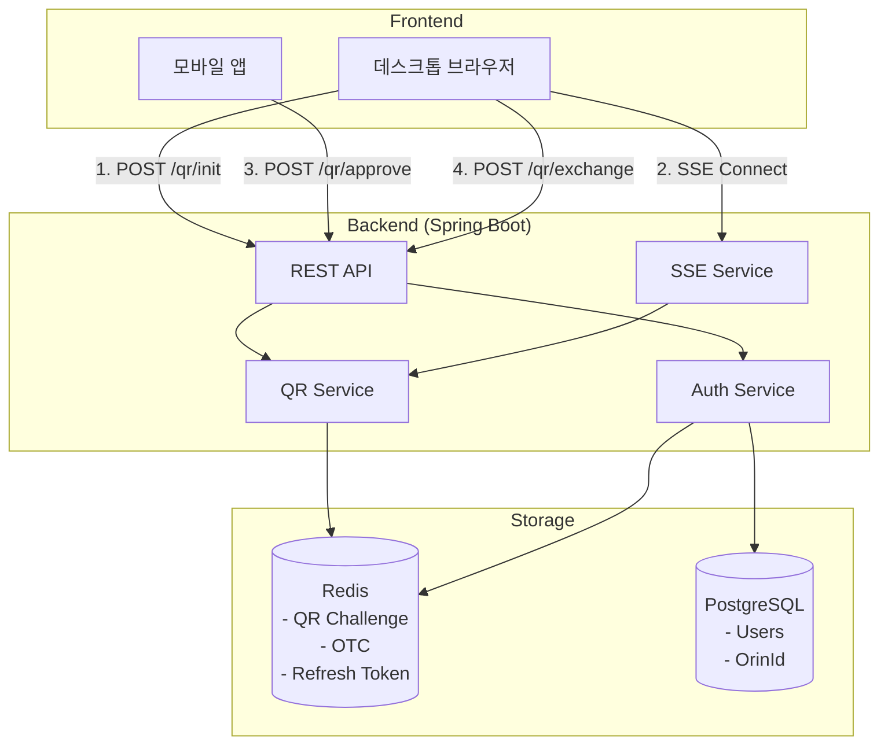
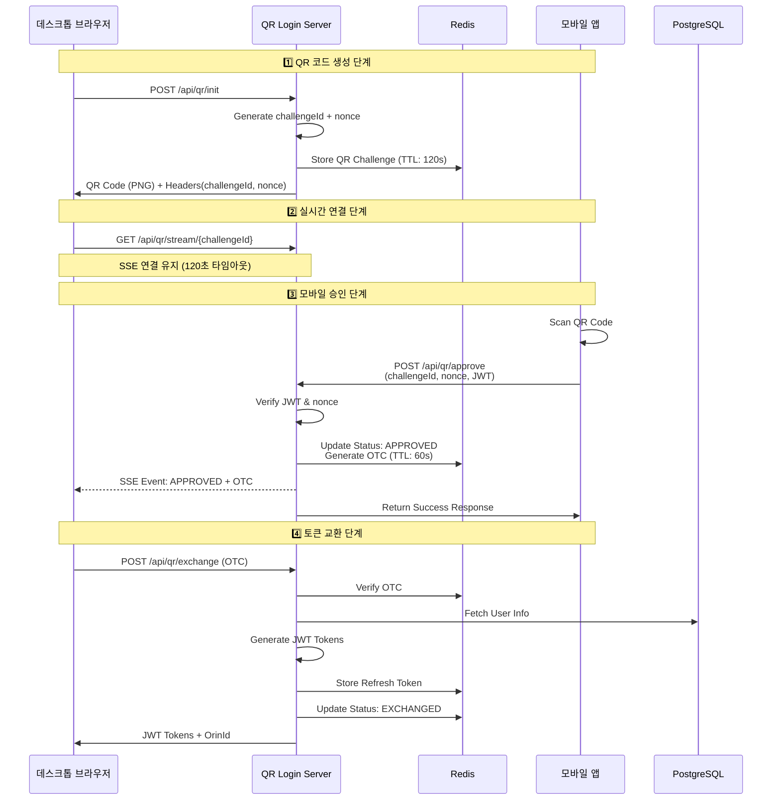

# QR Login System

> QR 코드 기반 인증 시스템 with Spring Boot + JWT + SSE + Redis

## 📖 개요

QR Login System은 모바일 앱에서 QR 코드를 스캔하여 데스크톱 브라우저에 자동으로 로그인할 수 있는 현대적인 인증 시스템입니다. 실시간 상태 업데이트(SSE)와 보안성을 강화한 JWT 기반 토큰 시스템, Redis 기반 세션 관리를 제공합니다.

## ✨ 주요 기능

- **🔐 QR 기반 로그인**: 모바일 앱으로 QR 코드 스캔하여 데스크톱 로그인
- **⚡ 실시간 상태 업데이트**: SSE(Server-Sent Events)를 통한 실시간 알림  
- **🛡️ JWT 인증 시스템**: Access/Refresh Token 패턴 + 토큰 회전(Rotation)
- **🆔 OrinId 관리**: 사용자별 고유 식별자 관리 시스템
- **👤 사용자 관리**: 회원가입/로그인/역할 기반 인증(RBAC)
- **📱 RESTful API**: 완전한 REST API 지원
- **📚 API 문서화**: Swagger/OpenAPI 3.0 통합
- **🐳 Docker 지원**: 완전한 컨테이너화 환경

## 🏗️ 아키텍처

### 시스템 구성도



### QR 로그인 시퀀스 다이어그램



## 🚀 빠른 시작

### 전제 조건

- Docker & Docker Compose
- Java 17+ (로컬 개발 시)
- Git

### Docker로 실행

```bash
# 저장소 클론
git clone <repository-url>
cd qr-login-system

# Docker 컨테이너 실행
docker compose up -d

# 애플리케이션 상태 확인
curl http://localhost:8090/actuator/health
```

### 로컬 개발 환경

```bash
# Gradle 빌드
./gradlew build

# 로컬 프로필로 실행 (H2 데이터베이스 사용)
./gradlew bootRun --args='--spring.profiles.active=local'
```

## 📋 API 엔드포인트

### 🔐 인증 API

| Method | Endpoint | 설명 | 인증 필요 |
|--------|----------|------|-----------|
| POST | `/api/auth/signup` | 사용자 회원가입 | ❌ |
| POST | `/api/auth/login` | 이메일/패스워드 로그인 | ❌ |
| POST | `/api/auth/refresh` | 토큰 갱신 | ❌ |

### 📱 QR 로그인 API  

| Method | Endpoint | 설명 | 인증 필요 |
|--------|----------|------|-----------|
| POST | `/api/qr/init` | QR 코드 생성 | ❌ |
| POST | `/api/qr/approve` | QR 코드 승인 (모바일) | ✅ |
| GET | `/api/qr/status/{challengeId}` | QR 상태 확인 | ❌ |
| POST | `/api/qr/exchange` | OTC → JWT 토큰 교환 | ❌ |
| POST | `/api/qr/token/refresh` | QR 로그인 토큰 갱신 | ❌ |

### 🌊 실시간 SSE API

| Method | Endpoint | 설명 | 인증 필요 |
|--------|----------|------|-----------|
| GET | `/api/qr/stream/{challengeId}` | SSE 실시간 상태 스트림 | ❌ |
| GET | `/api/qr/stream/stats/{challengeId}` | SSE 연결 통계 | ❌ |

### 🆔 OrinId API

| Method | Endpoint | 설명 | 인증 필요 |
|--------|----------|------|-----------|
| GET | `/api/orin/my` | 내 OrinId 조회 | ✅ |
| PUT | `/api/orin/my` | 내 OrinId 변경 | ✅ |
| DELETE | `/api/orin/my` | 내 OrinId 삭제 | ✅ |
| GET | `/api/orin/check/{orinId}` | OrinId 사용 가능 여부 | ❌ |
| GET | `/api/orin/user/{orinId}` | OrinId로 사용자 조회 | ✅ |

### 👤 사용자 API

| Method | Endpoint | 설명 | 인증 필요 |
|--------|----------|------|-----------|
| GET | `/api/users/me` | 현재 사용자 정보 조회 | ✅ |

## 💻 프론트엔드 구현 가이드

### 📱 기술 스택 선택

#### React 기반 구현 (권장)
```bash
# Create React App with TypeScript
npx create-react-app qr-login-frontend --template typescript

# 필요한 패키지 설치
npm install axios
npm install react-qr-reader  # 모바일용 QR 스캐너
npm install js-cookie
npm install react-router-dom
```

#### Vue.js 기반 구현
```bash
# Vue CLI 프로젝트 생성
npm create vue@latest qr-login-frontend

# 필요한 패키지 설치
npm install axios
npm install qrcode-reader-vue3  # Vue3용 QR 스캐너
npm install vue-router
```

### 🖥️ 데스크톱 브라우저 구현

#### 1. QR 로그인 컴포넌트 (React + TypeScript)

```typescript
// components/QrLogin.tsx
import React, { useState, useEffect, useRef } from 'react';
import axios from 'axios';

interface QrLoginProps {
  onLoginSuccess: (tokens: TokenResponse) => void;
}

interface TokenResponse {
  accessToken: string;
  refreshToken: string;
  orinId?: string;
  accessTokenExpiresIn: number;
  refreshTokenExpiresIn: number;
}

const QrLogin: React.FC<QrLoginProps> = ({ onLoginSuccess }) => {
  const [qrCode, setQrCode] = useState<string>('');
  const [challengeId, setChallengeId] = useState<string>('');
  const [status, setStatus] = useState<'loading' | 'ready' | 'approved' | 'expired' | 'error'>('loading');
  const [countdown, setCountdown] = useState<number>(120);
  const eventSourceRef = useRef<EventSource | null>(null);
  const countdownIntervalRef = useRef<NodeJS.Timeout | null>(null);

  // QR 코드 초기화
  const initializeQr = async () => {
    try {
      setStatus('loading');
      const response = await axios.post('/api/qr/init', null, {
        responseType: 'blob'
      });
      
      // 헤더에서 challengeId 추출
      const challengeId = response.headers['x-challenge-id'];
      setChallengeId(challengeId);
      
      // Blob을 URL로 변환
      const imageUrl = URL.createObjectURL(response.data);
      setQrCode(imageUrl);
      setStatus('ready');
      setCountdown(120);
      
      // SSE 연결 시작
      connectSSE(challengeId);
      
      // 카운트다운 시작
      startCountdown();
    } catch (error) {
      console.error('Failed to initialize QR:', error);
      setStatus('error');
    }
  };

  // SSE 연결
  const connectSSE = (challengeId: string) => {
    // 기존 연결 종료
    if (eventSourceRef.current) {
      eventSourceRef.current.close();
    }

    const eventSource = new EventSource(`/api/qr/stream/${challengeId}`);
    eventSourceRef.current = eventSource;

    eventSource.onopen = () => {
      console.log('SSE connection opened');
    };

    eventSource.onmessage = async (event) => {
      try {
        const data = JSON.parse(event.data);
        console.log('SSE message received:', data);
        
        if (data.status === 'APPROVED' && data.otc) {
          setStatus('approved');
          await exchangeOtcForToken(data.otc);
        }
      } catch (error) {
        console.error('Failed to process SSE message:', error);
      }
    };

    eventSource.onerror = (error) => {
      console.error('SSE error:', error);
      eventSource.close();
      setStatus('error');
    };
  };

  // OTC를 토큰으로 교환
  const exchangeOtcForToken = async (otc: string) => {
    try {
      const response = await axios.post<TokenResponse>('/api/qr/exchange', { otc });
      
      // 토큰 저장
      localStorage.setItem('accessToken', response.data.accessToken);
      localStorage.setItem('refreshToken', response.data.refreshToken);
      if (response.data.orinId) {
        localStorage.setItem('orinId', response.data.orinId);
      }
      
      // 성공 콜백
      onLoginSuccess(response.data);
    } catch (error) {
      console.error('Failed to exchange OTC:', error);
      setStatus('error');
    }
  };

  // 카운트다운
  const startCountdown = () => {
    if (countdownIntervalRef.current) {
      clearInterval(countdownIntervalRef.current);
    }

    countdownIntervalRef.current = setInterval(() => {
      setCountdown((prev) => {
        if (prev <= 1) {
          setStatus('expired');
          return 0;
        }
        return prev - 1;
      });
    }, 1000);
  };

  // 컴포넌트 마운트
  useEffect(() => {
    initializeQr();

    // 클린업
    return () => {
      if (eventSourceRef.current) {
        eventSourceRef.current.close();
      }
      if (countdownIntervalRef.current) {
        clearInterval(countdownIntervalRef.current);
      }
      if (qrCode) {
        URL.revokeObjectURL(qrCode);
      }
    };
  }, []);

  return (
    <div className="qr-login-container">
      <h2>QR 코드로 로그인</h2>
      
      {status === 'loading' && <div className="spinner">Loading...</div>}
      
      {status === 'ready' && (
        <>
          <div className="qr-code-wrapper">
            
            <div className="countdown">{countdown}초 남음</div>
          </div>
          <p>모바일 앱으로 QR 코드를 스캔하세요</p>
        </>
      )}
      
      {status === 'approved' && (
        <div className="success-message">
          <span>✅</span> 승인되었습니다. 로그인 중...
        </div>
      )}
      
      {status === 'expired' && (
        <div className="error-message">
          <p>QR 코드가 만료되었습니다.</p>
          <button onClick={initializeQr}>새로고침</button>
        </div>
      )}
      
      {status === 'error' && (
        <div className="error-message">
          <p>오류가 발생했습니다.</p>
          <button onClick={initializeQr}>다시 시도</button>
        </div>
      )}
    </div>
  );
};

export default QrLogin;
```

#### 2. API 인터셉터 설정 (axios)

```typescript
// utils/api.ts
import axios from 'axios';

const API_BASE_URL = process.env.REACT_APP_API_URL || 'http://localhost:8090';

const api = axios.create({
  baseURL: API_BASE_URL,
  timeout: 30000,
});

// Request 인터셉터 - 토큰 자동 추가
api.interceptors.request.use(
  (config) => {
    const token = localStorage.getItem('accessToken');
    if (token) {
      config.headers.Authorization = `Bearer ${token}`;
    }
    return config;
  },
  (error) => Promise.reject(error)
);

// Response 인터셉터 - 토큰 갱신
api.interceptors.response.use(
  (response) => response,
  async (error) => {
    const originalRequest = error.config;
    
    if (error.response?.status === 401 && !originalRequest._retry) {
      originalRequest._retry = true;
      
      try {
        const refreshToken = localStorage.getItem('refreshToken');
        const response = await axios.post(`${API_BASE_URL}/api/qr/token/refresh`, {
          refreshToken
        });
        
        localStorage.setItem('accessToken', response.data.accessToken);
        localStorage.setItem('refreshToken', response.data.refreshToken);
        
        originalRequest.headers.Authorization = `Bearer ${response.data.accessToken}`;
        return api(originalRequest);
      } catch (refreshError) {
        // 리프레시 실패 - 로그아웃 처리
        localStorage.clear();
        window.location.href = '/login';
        return Promise.reject(refreshError);
      }
    }
    
    return Promise.reject(error);
  }
);

export default api;
```

### 📱 모바일 앱 구현

#### 1. QR 스캐너 컴포넌트 (React Native)

```typescript
// screens/QrScanner.tsx
import React, { useState } from 'react';
import { View, Text, Alert, StyleSheet } from 'react-native';
import QRCodeScanner from 'react-native-qrcode-scanner';
import { RNCamera } from 'react-native-camera';
import api from '../utils/api';

interface QrData {
  challengeId: string;
  nonce: string;
}

const QrScanner: React.FC = () => {
  const [isScanning, setIsScanning] = useState(true);
  const [isProcessing, setIsProcessing] = useState(false);

  const onQrCodeRead = async (e: any) => {
    if (isProcessing) return;
    
    try {
      setIsProcessing(true);
      setIsScanning(false);
      
      // QR 데이터 파싱
      const qrData: QrData = JSON.parse(e.data);
      
      // QR 승인 요청
      await approveQrLogin(qrData);
      
    } catch (error) {
      console.error('QR processing error:', error);
      Alert.alert(
        '오류',
        'QR 코드 처리 중 오류가 발생했습니다.',
        [
          {
            text: '다시 시도',
            onPress: () => {
              setIsScanning(true);
              setIsProcessing(false);
            }
          }
        ]
      );
    }
  };

  const approveQrLogin = async (qrData: QrData) => {
    try {
      const response = await api.post('/api/qr/approve', {
        challengeId: qrData.challengeId,
        nonce: qrData.nonce
      });
      
      Alert.alert(
        '성공',
        '데스크톱 로그인이 승인되었습니다.',
        [
          {
            text: '확인',
            onPress: () => {
              // 홈 화면으로 이동
              navigation.navigate('Home');
            }
          }
        ]
      );
    } catch (error: any) {
      throw new Error(error.response?.data?.message || 'QR 승인 실패');
    }
  };

  return (
    <View style={styles.container}>
      {isScanning && (
        <QRCodeScanner
          onRead={onQrCodeRead}
          flashMode={RNCamera.Constants.FlashMode.off}
          topContent={
            <Text style={styles.centerText}>
              데스크톱의 QR 코드를 스캔하세요
            </Text>
          }
          bottomContent={
            <Text style={styles.textBold}>
              카메라를 QR 코드에 맞춰주세요
            </Text>
          }
        />
      )}
      
      {isProcessing && (
        <View style={styles.processing}>
          <Text>처리 중...</Text>
        </View>
      )}
    </View>
  );
};

const styles = StyleSheet.create({
  container: {
    flex: 1,
  },
  centerText: {
    fontSize: 18,
    padding: 32,
    color: '#777',
  },
  textBold: {
    fontSize: 16,
    fontWeight: '500',
    color: '#000',
  },
  processing: {
    flex: 1,
    justifyContent: 'center',
    alignItems: 'center',
  },
});

export default QrScanner;
```

#### 2. 모바일 인증 서비스

```typescript
// services/authService.ts
import AsyncStorage from '@react-native-async-storage/async-storage';
import api from '../utils/api';

class AuthService {
  // 로그인
  async login(email: string, password: string) {
    try {
      const response = await api.post('/api/auth/login', {
        email,
        password
      });
      
      // 토큰 저장
      await AsyncStorage.setItem('accessToken', response.data.accessToken);
      await AsyncStorage.setItem('refreshToken', response.data.refreshToken);
      if (response.data.orinId) {
        await AsyncStorage.setItem('orinId', response.data.orinId);
      }
      
      return response.data;
    } catch (error) {
      throw error;
    }
  }

  // 토큰 갱신
  async refreshToken() {
    try {
      const refreshToken = await AsyncStorage.getItem('refreshToken');
      if (!refreshToken) throw new Error('No refresh token');
      
      const response = await api.post('/api/auth/refresh', {
        refreshToken
      });
      
      await AsyncStorage.setItem('accessToken', response.data.accessToken);
      await AsyncStorage.setItem('refreshToken', response.data.refreshToken);
      
      return response.data;
    } catch (error) {
      // 리프레시 실패 - 로그아웃
      await this.logout();
      throw error;
    }
  }

  // 로그아웃
  async logout() {
    await AsyncStorage.multiRemove(['accessToken', 'refreshToken', 'orinId']);
  }

  // 현재 토큰 가져오기
  async getAccessToken() {
    return await AsyncStorage.getItem('accessToken');
  }
}

export default new AuthService();
```

### 🎨 UI/UX 디자인 가이드

#### 1. QR 로그인 화면 스타일 (CSS)

```css
/* styles/QrLogin.css */
.qr-login-container {
  display: flex;
  flex-direction: column;
  align-items: center;
  padding: 2rem;
  max-width: 400px;
  margin: 0 auto;
}

.qr-code-wrapper {
  position: relative;
  padding: 1rem;
  background: white;
  border-radius: 12px;
  box-shadow: 0 4px 6px rgba(0, 0, 0, 0.1);
}

.qr-code-wrapper img {
  display: block;
}

.countdown {
  position: absolute;
  bottom: -10px;
  right: -10px;
  background: #007bff;
  color: white;
  padding: 0.5rem 1rem;
  border-radius: 20px;
  font-size: 14px;
  font-weight: bold;
}

.spinner {
  width: 50px;
  height: 50px;
  border: 3px solid #f3f3f3;
  border-top: 3px solid #007bff;
  border-radius: 50%;
  animation: spin 1s linear infinite;
}

@keyframes spin {
  0% { transform: rotate(0deg); }
  100% { transform: rotate(360deg); }
}

.success-message {
  display: flex;
  align-items: center;
  gap: 1rem;
  padding: 1rem 2rem;
  background: #d4edda;
  color: #155724;
  border-radius: 8px;
  font-weight: 500;
}

.error-message {
  text-align: center;
  padding: 1rem;
  background: #f8d7da;
  color: #721c24;
  border-radius: 8px;
}

.error-message button {
  margin-top: 1rem;
  padding: 0.5rem 2rem;
  background: #007bff;
  color: white;
  border: none;
  border-radius: 4px;
  cursor: pointer;
}

.error-message button:hover {
  background: #0056b3;
}
```

### 🔒 보안 고려사항

#### 1. 토큰 저장 전략

```typescript
// utils/tokenManager.ts
class TokenManager {
  private readonly ACCESS_TOKEN_KEY = 'access_token';
  private readonly REFRESH_TOKEN_KEY = 'refresh_token';
  
  // HttpOnly 쿠키 사용 (권장)
  setTokensInCookie(accessToken: string, refreshToken: string) {
    // 서버에서 HttpOnly 쿠키로 설정하는 것이 가장 안전
    // 클라이언트에서는 설정 불가
  }
  
  // localStorage 사용 (간편하지만 XSS 취약)
  setTokensInLocalStorage(accessToken: string, refreshToken: string) {
    localStorage.setItem(this.ACCESS_TOKEN_KEY, accessToken);
    localStorage.setItem(this.REFRESH_TOKEN_KEY, refreshToken);
  }
  
  // sessionStorage 사용 (브라우저 종료 시 삭제)
  setTokensInSessionStorage(accessToken: string, refreshToken: string) {
    sessionStorage.setItem(this.ACCESS_TOKEN_KEY, accessToken);
    sessionStorage.setItem(this.REFRESH_TOKEN_KEY, refreshToken);
  }
  
  // Memory 저장 (가장 안전하지만 새로고침 시 손실)
  private tokens = {
    accessToken: '',
    refreshToken: ''
  };
  
  setTokensInMemory(accessToken: string, refreshToken: string) {
    this.tokens.accessToken = accessToken;
    this.tokens.refreshToken = refreshToken;
  }
}
```

#### 2. CSRF 보호

```typescript
// utils/csrf.ts
class CsrfProtection {
  private csrfToken: string = '';
  
  async fetchCsrfToken() {
    const response = await fetch('/api/csrf-token');
    this.csrfToken = await response.text();
    return this.csrfToken;
  }
  
  getHeaders() {
    return {
      'X-CSRF-Token': this.csrfToken
    };
  }
}
```

### 📊 모니터링 및 에러 처리

```typescript
// utils/errorHandler.ts
class ErrorHandler {
  handleQrError(error: any) {
    const errorMessages: Record<string, string> = {
      'INVALID_CHALLENGE': 'QR 코드가 유효하지 않습니다.',
      'EXPIRED_CHALLENGE': 'QR 코드가 만료되었습니다.',
      'INVALID_NONCE': '보안 검증에 실패했습니다.',
      'ALREADY_EXCHANGED': '이미 사용된 QR 코드입니다.',
      'NETWORK_ERROR': '네트워크 연결을 확인해주세요.',
    };
    
    const errorCode = error.response?.data?.code;
    return errorMessages[errorCode] || '알 수 없는 오류가 발생했습니다.';
  }
  
  logError(error: any, context: string) {
    console.error(`[${context}]`, error);
    
    // 프로덕션에서는 에러 추적 서비스로 전송
    if (process.env.NODE_ENV === 'production') {
      // Sentry, LogRocket 등으로 에러 전송
    }
  }
}
```

### 🚀 프로덕션 배포 체크리스트

- [ ] HTTPS 적용 확인
- [ ] CORS 설정 확인
- [ ] 환경 변수 설정 (API_URL 등)
- [ ] 에러 트래킹 설정 (Sentry 등)
- [ ] 성능 모니터링 설정
- [ ] 토큰 저장 방식 결정 (HttpOnly Cookie 권장)
- [ ] Rate Limiting 확인
- [ ] SSL Pinning 적용 (모바일)
- [ ] 코드 난독화 (프로덕션 빌드)
- [ ] 보안 헤더 설정 (CSP, X-Frame-Options 등)

## 🔄 QR 로그인 플로우 (이전 내용 유지)

### 1. 데스크톱 브라우저 (간단한 구현 예시)

```javascript
// 1. QR 코드 초기화
const initResponse = await fetch('/api/qr/init', { method: 'POST' });
const challengeId = initResponse.headers.get('X-Challenge-Id');

// 2. SSE 연결로 실시간 상태 수신
const eventSource = new EventSource(`/api/qr/stream/${challengeId}`);

eventSource.onmessage = async (event) => {
  const data = JSON.parse(event.data);
  
  if (data.status === 'APPROVED') {
    // 3. OTC를 토큰으로 교환
    const tokenResponse = await fetch('/api/qr/exchange', {
      method: 'POST',
      headers: { 'Content-Type': 'application/json' },
      body: JSON.stringify({ otc: data.otc })
    });
    
    const tokens = await tokenResponse.json();
    localStorage.setItem('accessToken', tokens.accessToken);
    localStorage.setItem('refreshToken', tokens.refreshToken);
    // 로그인 완료!
  }
};
```

### 2. 모바일 앱 (간단한 구현 예시)

```javascript
// QR 코드 스캔 후 challengeId와 nonce 추출

// QR 승인 (JWT 토큰 필요)
const approveResponse = await fetch('/api/qr/approve', {
  method: 'POST',
  headers: { 
    'Content-Type': 'application/json',
    'Authorization': `Bearer ${userJwtToken}`
  },
  body: JSON.stringify({ 
    challengeId: scannedChallengeId,
    nonce: scannedNonce 
  })
});

// 승인 완료 시 성공 메시지 수신
const result = await approveResponse.json();
console.log('QR 승인 완료:', result.message);
```

## 🛠️ 기술 스택

### 백엔드
- **Spring Boot 3.2.5** - 메인 프레임워크
- **Spring Security** - 인증/보안
- **Spring Data JPA** - ORM
- **Spring Data Redis** - 캐시/세션
- **JWT (JJWT 0.12.3)** - 토큰 인증
- **Java 17** - 언어 버전

### 데이터베이스
- **PostgreSQL 16** - 메인 데이터베이스 (운영)
- **H2** - 인메모리 데이터베이스 (개발)  
- **Redis 7** - 세션 저장소 및 QR 챌린지 캐시
- **Flyway** - 데이터베이스 마이그레이션

### 기타 라이브러리
- **ZXing** - QR 코드 생성
- **SpringDoc OpenAPI** - API 문서화
- **Lombok** - 보일러플레이트 코드 제거
- **Jackson JSR310** - 날짜/시간 직렬화

## 🐳 Docker 구성

### 서비스 구성

```yaml
services:
  db:          # PostgreSQL 16
  redis:       # Redis 7  
  app:         # Spring Boot Application
```

### 환경 변수

| 변수명 | 기본값 | 설명 |
|--------|--------|------|
| `DATABASE_HOST` | `db` | PostgreSQL 호스트 |
| `DATABASE_PORT` | `5433` | PostgreSQL 포트 |
| `DATABASE_NAME` | `qrlogin` | 데이터베이스 이름 |
| `DATABASE_USER` | `qrlogin` | DB 사용자 |
| `DATABASE_PASSWORD` | `qrlogin123` | DB 비밀번호 |
| `SPRING_REDIS_HOST` | `redis` | Redis 호스트 |
| `SPRING_REDIS_PORT` | `6379` | Redis 포트 |

## 🔐 보안 설정

### JWT 토큰 구성

```yaml
jwt:
  secret: "your-256-bit-secret"
  access-token:
    expiration: 900000      # 15분
  refresh-token:  
    expiration: 604800000   # 7일
  issuer: qr-login-system
```

### 보안 특징

1. **JWT 토큰 보안**
   - Access Token: 15분 만료
   - Refresh Token: 7일 만료
   - 토큰 회전 메커니즘 (이미 사용된 토큰 재사용 방지)

2. **QR 챌린지 보안**
   - 120초 TTL (Time To Live)
   - Nonce를 통한 재생 공격 방지
   - OTC(One-Time Code) 일회성 사용

3. **CORS 설정**
   - 허용된 도메인: 
     - `https://minjcho.site`
     - `https://a205.vercel.app`
     - `https://a205test.vercel.app`
   - 로컬 개발 환경 지원

4. **Rate Limiting**
   - SSE 연결: IP당 최대 10연결/1분

### 인증이 필요한 엔드포인트

- `POST /api/qr/approve` - QR 코드 승인
- `GET /api/users/me` - 사용자 정보 조회
- `GET /api/orin/my` - OrinId 조회
- `PUT /api/orin/my` - OrinId 변경
- `DELETE /api/orin/my` - OrinId 삭제
- `GET /api/orin/user/{orinId}` - OrinId로 사용자 조회

### 기본 사용자 계정

| 이메일 | 비밀번호 | 역할 |
|--------|----------|------|
| `admin@example.com` | `admin123` | ADMIN |
| `user@example.com` | `user123` | USER |

## 📚 API 문서

### Swagger UI
- **개발**: http://localhost:8090/swagger-ui.html
- **OpenAPI JSON**: http://localhost:8090/v3/api-docs

### API 사용 예시

```bash
# 1. 사용자 회원가입
curl -X POST http://localhost:8090/api/auth/signup \
  -H "Content-Type: application/json" \
  -d '{"email":"test@example.com","password":"password123"}'

# 2. 로그인
curl -X POST http://localhost:8090/api/auth/login \
  -H "Content-Type: application/json" \
  -d '{"email":"test@example.com","password":"password123"}'

# 3. QR 코드 생성
curl -X POST http://localhost:8090/api/qr/init -o qr_code.png

# 4. 사용자 정보 조회 (JWT 토큰 필요)
curl -H "Authorization: Bearer YOUR_ACCESS_TOKEN" \
  http://localhost:8090/api/users/me

# 5. OrinId 조회 (JWT 토큰 필요)
curl -H "Authorization: Bearer YOUR_ACCESS_TOKEN" \
  http://localhost:8090/api/orin/my

# 6. OrinId 변경 (JWT 토큰 필요)
curl -X PUT http://localhost:8090/api/orin/my \
  -H "Authorization: Bearer YOUR_ACCESS_TOKEN" \
  -H "Content-Type: application/json" \
  -d '{"orinId":"newOrinId123"}'
```

## 🧪 테스트

### 테스트 실행

```bash
# 전체 테스트
./gradlew test

# 특정 테스트 클래스
./gradlew test --tests="AuthControllerTest"

# 통합 테스트 (Testcontainers 사용)
./gradlew integrationTest
```

### 테스트 구성

- **단위 테스트**: Service, Util 레이어
- **통합 테스트**: Controller, Repository 레이어
- **보안 테스트**: 인증/인가 시나리오
- **SSE 테스트**: 실시간 스트리밍 기능

## 🔧 개발 환경

### 프로젝트 구조

```
src/main/java/com/example/qrlogin/
├── auth/                    # 인증 관련 컴포넌트
├── config/                  # 설정 클래스
├── controller/              # REST 컨트롤러  
├── dto/                     # 데이터 전송 객체
├── entity/                  # JPA 엔티티
├── exception/               # 예외 처리
├── repository/              # 데이터 접근 계층
├── service/                 # 비즈니스 로직
├── user/                    # 사용자 관리
└── util/                    # 유틸리티
```

### 프로파일별 설정

- **local**: H2 인메모리 DB, 개발용 설정
- **docker**: PostgreSQL (포트 5433) + Redis, 운영용 설정

## 📊 모니터링

### 헬스체크

```bash
# 애플리케이션 상태
curl http://localhost:8090/actuator/health

# SSE 연결 통계  
curl http://localhost:8090/api/qr/stream/stats/{challengeId}
```

### 로그 확인

```bash
# Docker 로그
docker compose logs -f app

# 로그 파일 (컨테이너 내부)
tail -f /app/logs/qr-login-system.log
```

## 🚀 배포

### 프로덕션 배포

```bash
# 프로덕션 빌드
docker compose -f docker-compose.prod.yml up -d

# 환경 변수 설정
export DATABASE_PASSWORD="secure_password"
export JWT_SECRET="your-secure-256-bit-secret"
```

### 성능 튜닝

- **JVM 옵션**: `-Xmx512m -Xms256m`
- **커넥션 풀**: HikariCP (최대 10개 연결)
- **Redis 풀**: Lettuce (최대 8개 연결)
- **SSE 제한**: IP당 최대 10연결/1분

## 🎯 프로덕션 체크리스트

### 배포 전 확인사항
- [ ] JWT Secret 변경 (최소 256비트)
- [ ] CORS 도메인 설정
- [ ] SSL/TLS 인증서 설정
- [ ] Rate Limiting 설정
- [ ] 로그 레벨 조정 (INFO/WARN)
- [ ] 데이터베이스 백업 설정
- [ ] 모니터링 도구 설정
- [ ] 헬스체크 엔드포인트 설정

